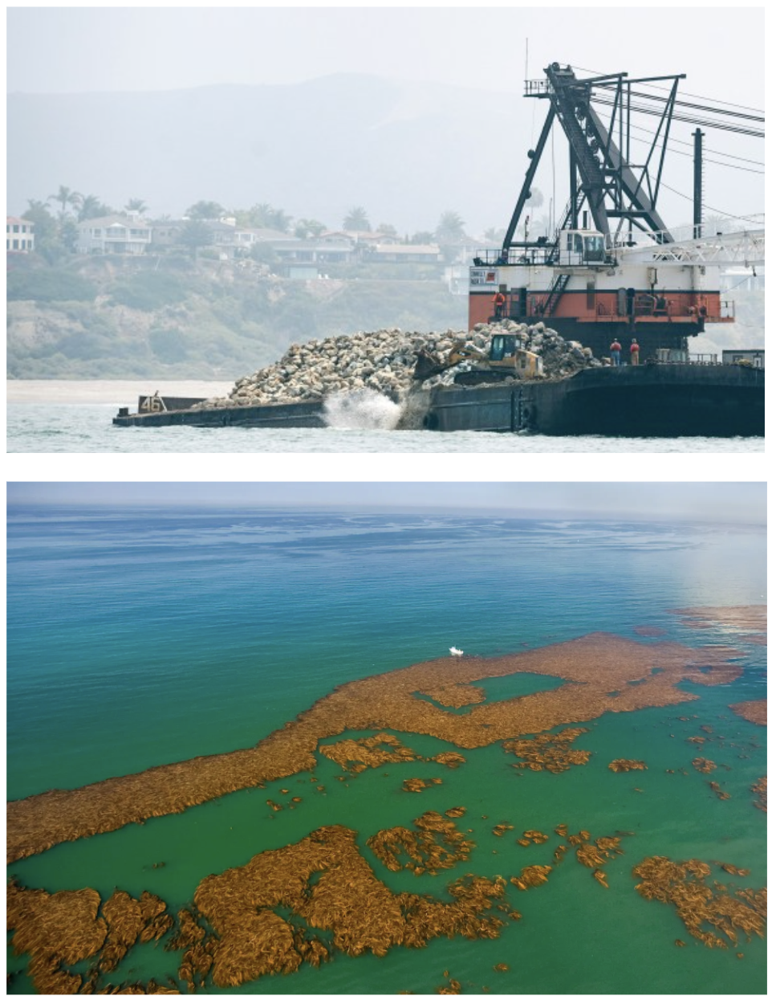
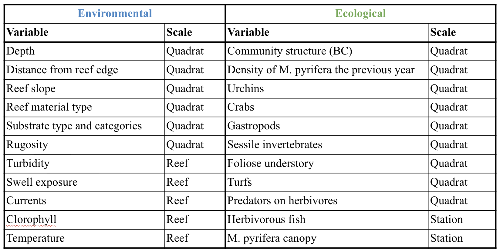

# Overview

To interpret and predict the patterns observed in nature accurately, our methods of study must embrace temporal and spatial variability as essential features of population and community dynamics. Preexisting conditions of the environment, such as substratum features that influence refuge availability, and of a population (e.g., size and age structure) and life history traits (e.g., propagule production, dispersal capacity) will influence the importance of mechanisms of resilience and stability. Hence, an assessment of the separate and interactive effects of these environmental and ecological factors is required for a comprehensive understanding of population dynamics. Annual monitoring of the largest artificial reef in temperate regions, the Wheeler North Reef, provides an opportunity to explore a spatially explicit and long-term datase, in the vicinity of the San Onofre Nuclear Generating Station (SONGS), in southern California. Specifically, it allows me to address the following question:

-   Can a combination of substrate type best predict values of kelp density at the Wheeler North Artificial Reef?

{fig-align="center" width="523"}

# **Significance**

Interest in artificial reefs in California’s waters is growing rapidly. This interest is spurred by their potential roles in ameliorating climate impacts. These massive interventions can expand the seafloor area that supports species-rich and productive kelp forests and the many ecosystem services they provide. Like coral reefs, rocky reefs can increase coastal protection from the increased frequency and magnitude of storm events predicted by climate models. Artificial reefs can facilitate population connectivity among natural reefs by larval dispersal and fish movement, facilitating the replenishment and resilience of natural reef communities impacted by climate stressors. However, these are very expensive interventions and well-informed, well-designed climate-ready reefs can provide these ameliorating effects while increasing the likelihood of forest ecosystem persistence. By integrating long-term, spatially explicit ecological and substrate data, thus research aims to provide a piece of information to help guide the on on going California Department of Fish and Wildlife - California Artificial Reef Plan, to maximize kelp forest density associated ecosystem services.

# **Data adquisition**

\[Excerpt from the UCSB Marine Mitigation Program - <https://marinemitigation.msi.ucsb.edu/>\]

*The San Onofre Nuclear Generating Station (SONGS) Mitigation Monitoring Program is based at the Marine Science Institute, University of California Santa Barbara.Long-term monitoring and evaluation of the SONGS mitigation projects is a condition of the [**coastal development permit**](https://marinemitigation.msi.ucsb.edu/sites/default/files/documents/SONGS_permit_6-81-330-A_(formerly_183-73)_May1997.pdf) issued by the [**California Coastal Commission**](https://www.coastal.ca.gov/meetings/agenda/#/2022/2) (CCC) for the operation of SONGS Units 2 and 3. The Permit requires Southern California Edison (SCE) as majority owner and operating agent of SONGS to design and build mitigation projects that adequately compensate for the adverse effects of the power plant’s once-through seawater cooling system on living marine resources. UCSB scientists working under the direction of the Executive Director of the CCC are responsible for designing and implementing monitoring programs aimed at determining the effectiveness of these mitigation projects. Funding for the SONGS Mitigation Monitoring Program is provided by SCE as a requirement of their coastal development permit for operating SONGS.*

The raw layers of data used in this project can be found in the links below and include annual kelp stipe counts along 20m2 transects in semi-permanent sites, as well as percent substrate cover of 12 substrate types counted of 1m2 semi-permanent quadrats.

-   [**UCSB SONGS Reef Survey - Kelp Size and Abundance**](https://portal.edirepository.org/nis/mapbrowse?packageid=edi.667.5)

-   [**UCSB SONGS Reef Survey - Benthic Biota and Substrate Cover**](https://portal.edirepository.org/nis/mapbrowse?packageid=edi.670.5)

Preliminary data clean-up and manipulation of the Kelp Size and Abundance not shown in this project included: filtration of sites that were not physically paired, filtration of the sites that were monitored from 2009 to 2024 (Unit 2), and total fronds per 20m2 were calculated per transect_code.

# <!--Setting up -->

```{r}
#| label: clean and load packages
#| include: false

# Clean all 
#rm(list=ls())
#dev.off()

# Set working directory 
setwd("/Users/andreapaz/Documents/GitHub/W26_BIOE276_Final_Paz-Lacavex")

# Load libraries ---
library(dplyr)
library(ggplot2)
library(lme4)
library(brms)
library(tidyr)
library(ggeffects)
library(fitdistrplus)
library(pscl) #figuring out dist
library(MASS) #figuring out dist

# Load data ---
all_kelp <- read.csv("data_raw/new_updated_SONGS_20m2.csv")
all_benthic_cover<- read.csv("data_raw/all_benthic_cover.csv")
substrate_codes <- read.csv("data_raw/substrate_codes_names.csv")

#Selecting columns that we care about
all_benthic_cover_filt<- all_benthic_cover %>%
     dplyr::select (year, reef_code, transect_code, quadrat_distance, substrate_code, substrate_cover) #have to indicate package dplyr::, if not, overwritten by another package and does not run properly. Substrate cover is in %, of 20 points counted in a 1m2

#Merging both kelp and substrate df
kelp_substrate <- merge(all_kelp, all_benthic_cover_filt, by=c("transect_code","year","reef_code", "quadrat_distance")) # ,all.x = TRUE) #maintains all the rows - but we want to remove those that do not match because there are transects that only show until 2020 and that have already been filtered off all_kelp.  

#Making sure there are no NAs
kelp_substrate %>%
      filter(fronds_20m2 %>% is.na() == TRUE) #%>%
#Commented section if need to identify the NAs 
#Output = 0 rows

#Filter Wheeler North Reef
WNR_kelp_substrate<- kelp_substrate %>%
      filter(reef_code == "WNR")

#How many distinct transects?
WNR_kelp_substrate |> 
  dplyr::select(transect_code) |> 
  distinct() |> 
  count() 
#Output = 80 transects

#Turning subtrate into long format --- This is the dataset to be used for the models below
WNR_kelp_substrate_years <- WNR_kelp_substrate |>
  pivot_wider(names_from = substrate_code, values_from = substrate_cover) # in case I want to select specific columns for the model

```

# Data exploration

## Kelp over time

This figure shows the mean kelp fronds per 20m2 per year across transects at Wheeler North Artificial Reef. 2009 marked the start of the Unit/Phase 2 of the WNR, with the largest increase in available reef surface since the experimental phases. This is why we see a large increase in fronds per 20m2 by 2010, as kelp recruited the year following installation.

```{r}
#| echo: false
#| fig-cap: "Mean fronds per 20m2 and standard error per year and across transects at Wheeler North Reef"


#Mean fronds per m2 across sites per year
WNR_avg_kelp_year <- all_kelp |> 
  filter(reef_code =="WNR") |> 
  group_by(year) |> 
  summarise(
    mean_fronds = mean(fronds_20m2, na.rm = TRUE),
    sd_fronds = sd(fronds_20m2, na.rm = TRUE),
    n_fronds = n(),  # number of quadrats per reef per year
    se_fronds = sd_fronds / sqrt(n_fronds),
    cv_fronds = ifelse(mean_fronds == 0, NA, sd_fronds / mean_fronds)
  )
  
#Plot mean fronds per m2 per site across time  
plot1 <- ggplot(WNR_avg_kelp_year, aes(x=year, y= mean_fronds))+
  geom_point(size = 0.8, alpha = 0.8)+
  geom_line()+
  geom_errorbar(aes(ymin = mean_fronds - se_fronds, ymax = mean_fronds + se_fronds),
                width = 0.2, alpha = 0.6)+
  theme_minimal()
plot1

## WE CAN SEE HOW KELP DENSITY HAS VARIED ACROSS TIME FOR THE WHEELER NORTH REEF - but not all sites have decreased
```

## Coefficient or variation of kelp

One way we can measure stability of a system is via the calculation of the coefficient of variation (CV), which is calculated by dividing the standard deviation by the sample mean, in this case per transect. This plot shows mean fronds per 20 m² per transect on the x-axis and the log-transformed CV per transect on the y-axis, and we can observe a linear negative relationship. Sites with the lowest CV, indicating greater stability, are associated with sites with the highest mean fronds per 20 m². This is relevant in the context of artificial reef design because it suggests that locations supporting higher kelp densities also tend to be more stable through time, meaning they experience less relative variability in kelp abundance.

```{r}
#| echo: false
#| fig-cap: "Histogram of distribution of fronds per 20 m² across time"

#Coefficient of variation of fronds_20m2 per site across time
WNR_mean_cv <- all_kelp |>
  filter(reef_code == "WNR") |>
  group_by(transect_code, quadrat_distance) |>
  summarise(
    mean_fronds = mean(fronds_20m2, na.rm = TRUE),
    n_fronds    = sum(!is.na(fronds_20m2)),
    sd_fronds   = if_else(n_fronds > 1, sd(fronds_20m2, na.rm = TRUE), NA_real_),
    se_fronds   = if_else(n_fronds > 1, sd_fronds / sqrt(n_fronds), NA_real_),
    cv_fronds   = if_else(mean_fronds == 0 | is.na(sd_fronds), NA_real_, sd_fronds / mean_fronds),
    .groups = "drop"
  )

#Testing data distribution 

#Plotting cv vs mean fronds - NOT RENDERED
# plot_22<- ggplot(WNR_mean_cv, aes(x=mean_fronds, y=cv_fronds))+
#   geom_point()+
#   geom_smooth(method = "lm") #may not be LM, can be tested. Could use method = "loess" shows the actual pattern without forcing a linear model
# plot_22 

#Check hist of dist
plot_33 <- ggplot(WNR_mean_cv, aes(x = cv_fronds)) +
  geom_histogram(bins = 20) +
  theme_classic()
plot_33
#not zero inflated

#testing common dist
mod_gaussian <- lm(cv_fronds ~ mean_fronds, data = WNR_mean_cv)
mod_gamma <- glm(cv_fronds ~ mean_fronds, family = Gamma(link="log"), data = WNR_mean_cv)
mod_lognorm <- lm(log(cv_fronds) ~ mean_fronds, data = WNR_mean_cv)

#AIC(mod_gaussian, mod_gamma, mod_lognorm)
#Log is the best dist with the lowest AIC
```

```{r}
#| echo: false
#| fig-cap: "Mean fronds per 20 m² transect vs log-transformed coefficient of variation (CV) per transect. Figure shows a negative linear relationship, with transects with the lowest CV, more stable, have the highest density of fronds per 20m2 across time."
ggplot(WNR_mean_cv, aes(mean_fronds, log(cv_fronds))) +
  geom_point() +
  geom_smooth(method = "lm") +
  theme_classic()
```

## Substrate over time

Given this relationship between kelp abundance and stability, a next step is to explore what environmental factors may help explain differences in kelp density across transects.



In this system, one likely driver is the composition of the benthic substrate. Different substrate types can influence kelp recruitment and persistence by affecting habitat complexity.

The following exploratory plot shows how the 12 substrate types (see Table below) that are part of the surveys have changed over time by calculating and plotting the mean and standard error across transects. Ideally, we would expect most substrate types to maintain relatively similar proportions through time. However, because this artificial reef is located in a dynamic site and continues to age, some variability is expected. In particular, sand, which shows the largest variability, can shift seasonally due to sediment movement. Additionally, seasonal changes in ocean conditions such as storms and swells may also influence substrate cover. It is also possible that the timing of the annual surveys varied slightly from year to year, which could further contribute to some of the variability observed in the substrate proportions.

```{r}
#| echo: false
#| warning: false
#| fig-cap: "Mean substrate cover and standard error across years at Wheeler North Reef"


#plotting substrate types over time
WNR_substrate_all<- WNR_kelp_substrate |> 
  group_by(year, substrate_code) |> #FIX NOT BY QUADRAT
  summarise(
    mean_sub = mean(substrate_cover, na.rm = TRUE),
    sd_sub = sd(substrate_cover, na.rm = TRUE),
    n_sub = n(),  # number of quadrats per reef per year
    se_sub = sd_sub / sqrt(n_sub),
    cv_sub = ifelse(mean_sub == 0, NA, sd_sub / mean_sub)
  )

WNR_substrate_all_2 <- WNR_substrate_all |>
  left_join(substrate_codes, by = "substrate_code")

print(substrate_codes)

plot3<- ggplot(WNR_substrate_all_2,
  aes(x = year, y = mean_sub, color = substrate_name)) +
  geom_point(size = 0.8, alpha = 0.8)+
  geom_line()+
  geom_errorbar(aes(ymin = mean_sub - se_sub, ymax = mean_sub + se_sub),
              width = 0.2, alpha = 0.6)+
  theme_minimal()

plot3
```

# Modeling

To evaluate whether substrate composition helps explain variation in kelp density, I modeled several approaches, all using **frond counts per transect (20 m²) as the response variable and the proportional cover of different substrate types across transects as predictors, while also accounting for the random effects of years and transects and then using years as an additional fixed effect.**

All models were implemented using a Bayesian framework with the `brms` package in R. The fundamentals of this approach were introduced by Professor Malin Pinski, with invaluable support from Teaching Assistant Calvin Munson.

After several trials, here I only show a few of the most relevant models given the question: Can **substrate type** help predict **kelp fronds** at the Wheeler North Artificial Reef?

## Negative binomial - Not Filtered

Below, we can see in the output that the model did not converge, as indicated by several diagnostics. First, the Rhat values were greater than 2, indicating poor mixing among chains. Additionally, the credible intervals for many parameters overlapped with zero, suggesting no meaningful differences among most substrate categories. The only categories that appeared to produce large estimates were INCD and UNKN, which likely reflects a data issue rather than a real ecological signal. After further inspection, I realized this was likely driven by the high number of zeros associated with those substrate types. Other warnings included a need to increase number of iterations, which I touch on in the next model.

Nonetheless, examining the variance components from the model suggested that approximately 69% of the variation in fronds per 20 m² was explained at the transect level, while year-to-year variation corresponded to roughly a 40-fold difference in expected kelp density.

```{r}
#| echo: false
#| fig-cap: "Histogram of distribution of fronds per 20m2 between 2009-2024"

#setting up the data
WNR_kelp_substrate_years <- WNR_kelp_substrate |>
  pivot_wider(names_from = substrate_code, values_from = substrate_cover) # in case I want to select specific columns for the model

#check normality of fronds_20m2, or change distribution
ggplot(WNR_kelp_substrate_years, aes(fronds_20m2)) +
  geom_histogram(bins = 30) +
  theme_classic()
#Gamma-Poisson (Negative binomial) would be appropiate (tested in the next section)

```

```{r}
#| echo: false
#| warning: false
#| fig-height: 8
#| fig-width: 8
#| fig-cap: "Negative binomial model output and diagnostic plots for kelp frond density as a function of substrate composition, with year and transect included as random effects."
 
# #### First model, did not converge
mod_fronds_sub<- brm(
  data = WNR_kelp_substrate_years,
  family = negbinomial(link = "log"),
  fronds_20m2 ~ 1+ BR + C + HARD + INCD + LB + MB + MS + P + S + SB + SH + UNKN +
    (1 | year) + (1 | transect_code), #can not have integers
  iter = 2000, warmup = 1000, chains = 4, cores = 4, seed = 4,
  file = "output/mod_fronds_sub"
)

#Could calcualte likelihood
print(mod_fronds_sub, digits=4)
plot(mod_fronds_sub)

#For interpretation
# (exp(0.49))
# (exp(3.7))

#a lot of warnings, rhat over 2, chains do not overlap nicely, plots are not bell/ish shaped, suggested to modify priors, not run the standard ones, and also will have to reduce the amount of substrate types since there are a few that are always 0.

```

## Negative binomial - Filtered

For the following model, I made the following modifications, to the data and also the model:

-   First, I filtered out those substrate types with only zeros, which were "Incidental" and "Unknown".

-   Additionally, data from 2009 was removed since it was the first year of the artificial reef and kelp had yet to successfully recruit.

-   Given the warnings of the first model, I also increased iterations from 2000 to 4000.

-   Although I already used it for the first model, I also tested different distributions and assessed which distribution fits best the filtered data by using Akaike Information Criterion, which compares goodness of fit criteria, and found that a negative binomial had the lowest score (best fit).

-   Given the extent of variance in kelp fronds per 20m2 attributed to the year to year effects, I added year as a fixed effect.

```{r}
#| echo: false
#| fig-cap: "Histogram of distribution of fronds per 20m2 between 2010-2024, after filtering out two substrate types: Incidental and Unknown"

#filtering out 2009
WNR_substrate_years_filt<-WNR_kelp_substrate_years |> 
  dplyr::filter(!(
    (year == "2009"))) |> 
  dplyr::select(-INCD, - UNKN)

#so that it doesn't take year as continous
WNR_substrate_years_filt$year <- as.factor(WNR_substrate_years_filt$year)

#plotting new df, still looking like Gamma-Poisson (Negative binomial)
ggplot(WNR_substrate_years_filt, aes(fronds_20m2)) +
  geom_histogram(bins = 100)  +
  theme_classic()
```

```{r}
#| echo: false
#| fig-cap: "Comparison of distributions for kelp frond density (fronds per 20 m²). Poisson, negative binomial, and zero-inflated negative binomial models were evaluated using AIC to determine the best distribution for modeling kelp counts."

#DISTRIBUTION
 #Testing distributions of the response variable, fronds 20m2

  # Poisson
  fit_pois <- glm(fronds_20m2 ~ 1, # as a function of only an intercept, noo predictors. Estimating the overall mean count
                  family = poisson,
                  data = WNR_substrate_years_filt)
  
  # Negative binomial
  fit_nb <- MASS::glm.nb( #if not called, some functions mix-up with dplyr/tidyverse
    fronds_20m2 ~ 1,
    data = WNR_substrate_years_filt,
    control = glm.control(maxit = 100) #adding this because when estimating the dispersion, I saw iteration limit reached
  )
  
  #ZI poisson
  fit_zip <- zeroinfl(fronds_20m2 ~ 1 | 1,
                    data = WNR_substrate_years_filt,
                    dist = "poisson")

  #ZI negbinomial
  fit_zinb <- zeroinfl(fronds_20m2 ~ 1 | 1,
                     data = WNR_substrate_years_filt,
                     dist = "negbin")
  #dist comparison - something wrong with NB
  
  AIC(fit_pois, fit_nb,fit_zip, fit_zinb)
  #negative binomial has the lowest goodness of fit criteria - AIC
```

As seen above, when I tested the best distribution, the AIC values for the negative binomial distribution what suspiciously low, but I decided to go with it and test both, negative binomial distribution and the second lowest AIC score, zero-inflated negative binomial (*also suggested as comments to my Final Slides submission*).

### Negative binomial

```{r}
#| echo: false
#| fig-height: 8
#| fig-width: 8
#| fig-cap: "Summary and diagnostic plots of the refined negative binomial model relating kelp frond density to substrate composition and year effects, while accounting for spatial variability among transects through a random intercept."

#"Fixed" model
mod_fronds_sub_2 <- brm(
  data = WNR_substrate_years_filt,
  family = negbinomial(link = "log"),
  fronds_20m2 ~ 0 + year + BR + C + HARD + LB + MB + MS + P + S + SB + SH +
   (1 | transect_code),
   prior = c(
    prior(normal(0, 3), class = "b")
  ),
  iter = 4000, warmup = 2000,
  chains = 4, cores = 4, seed = 4,
  file = "output/mod_fronds_sub_2"
)

#Could calculate likelihood
print(mod_fronds_sub_2, digits=4)
plot(mod_fronds_sub_2)

#For interpretation
# (exp(0.49)) #year to year
# (exp(2.6413)-1)*100 #2010
# 
# (exp(2.64)-1)*100 #transect
# #some subtrates
# (exp(0.0197)) #LB= 1.9% - lowest
# (exp( 0.0313 )) # BR = 3.1% - highest

```

The negative binomial model converged well, with Rhat values close to 1 across all parameters, indicating good mixing among chains. Variation among transects showed moderate spatial structure, with transects differing by roughly 1.6 times in expected kelp abundance. However, the strongest signal in the model was temporal variability. Years with high kelp abundance (such as 2010) were associated with approximately 13 times higher expected frond densities compared to the model baseline, while recent years showed dramatic declines. For example, the model estimates for 2023 and 2024 correspond to extremely low expected kelp densities relative to earlier years.

In contrast, substrate cover types showed relatively small positive associations with frond density. Across substrate types, increases in substrate cover were associated with roughly 1.9–3% increases in expected frond counts. Although several substrate effects were statistically detectable, their magnitude was small compared to the much larger temporal variability observed among years.

### Zero-inflated negative binomial

The zero-inflated negative binomial model converged well, with Rhat values close to 1 across all parameters, indicating good mixing among chains (although larger than the negative binomial model above). The model estimated that approximately 24% of observations correspond to zeros. Variation among transects was relatively low again, with transects differing by roughly 20% in expected kelp abundance. In contrast, year effects showed much larger differences in kelp density, with early years associated with substantially higher frond counts and recent years showing extremely low kelp densities.

Substrate effects were positive but small in magnitude. Across substrate types, increases in substrate cover were associated with \~2.5% increases in expected frond counts. Overall, these results, same as the model above, suggest that temporal variability is the dominant driver of kelp abundance at this site, while substrate composition plays a comparatively smaller role.

```{r}
#| echo: false
#| fig-height: 8
#| fig-width: 8
#| fig-cap: "Summary and diagnostic plots of the refined zer-inflated negative binomial model relating kelp frond density to substrate composition and year effects, while accounting for spatial variability among transects through a random intercept."
#| 
mod_fronds_sub_2_zinb <- brm(
  data = WNR_substrate_years_filt,
  family = zero_inflated_negbinomial(link = "log"),
  fronds_20m2 ~ 0 + year + BR + C + HARD + LB + MB + MS + P + S + SB + SH +
    (1 | transect_code),
  prior = c(
    prior(normal(0, 3), class = "b")
  ),
  iter = 4000, warmup = 2000, chains = 4, cores = 4, seed = 4,
  file = "output/mod_fronds_sub_2_zinb"
)

# Check model output
print(mod_fronds_sub_2_zinb, digits = 4)
plot(mod_fronds_sub_2_zinb)

#For interpretation
#zi = 24%
#((exp(0.0244)-1)*100)# BR = 2.4%

```

# Conclusions

Overall, these results suggest that interannual environmental conditions are the dominant driver of kelp abundance at this site. Substrate composition appears to play a more limited role, as substrate types were not substantially different from one another in their association with kelp density. Instead, much of the variation in frond counts is driven by spatial and temporal structure in the system (see figure below), indicating that year-to-year environmental variability likely explains most of the observed changes in kelp abundance (see figure below).

These findings also help guide the next steps in model development, suggesting that additional environmental and ecological variables should be explored, such as temperature, community composition, or recruitment in the previous year. From the perspective of artificial reef design, this implies that while substrate characteristics may facilitate kelp attachment, broader environmental conditions ultimately determine whether kelp forests persist and remain stable through time.

```{r}
#| echo: false
#| warning: false
#| fig-cap: "Interannual variation in kelp density"
#further exploratory data
ggplot(WNR_substrate_years_filt,
       aes(x = factor(year), y = fronds_20m2)) +
  geom_boxplot() +
  theme_classic() +
  labs(
    x = "Year",
    y = "Fronds per 20 m²",
    title = "Interannual variation in kelp density"
  )

```

# Future directions

A related question that emerges from these results is whether substrate type is associated with kelp stability over longer time scales. Stability can be evaluated through the coefficient of variation (CV), which captures how variable kelp density is relative to its mean. In the context of artificial reef design, this question is particularly relevant, because the goal is not only to promote kelp presence but also to support kelp communities that remain stable and persistent through time. Understanding whether certain substrate compositions are associated with lower variability in kelp abundance could therefore help inform reef design and placement decisions aimed at promoting long-term ecosystem stability.
